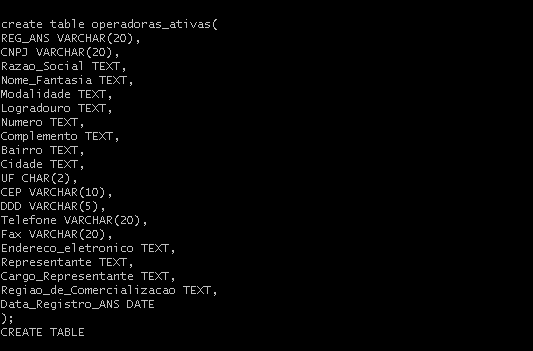
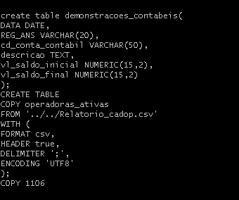
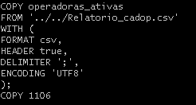
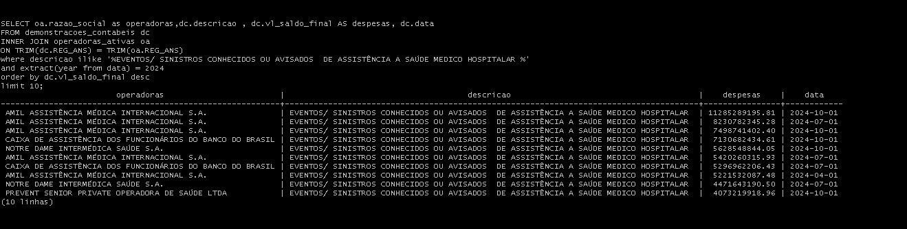

# Etapa 3 - Teste Técnico IntuitiveCare

## Descrição
Este projeto faz parte do teste técnico da IntuitiveCare. Ele utiliza PostgreSQL no ambiente Windows para realizar queries para estruturar tabelas necessárias para o arquivo csv e queries análisticas.

## Requisitos
- Windows
- PostgreSQL versão >10.0(contido no zip pgsql)
- GitBash

## Instalação

1. Extraia todos os arquivos ZIP dentro da pasta atual.

2. Abra o Bash na pasta raiz, navegue até a pasta **pgsql** e crie a pasta **data**:

```bash
mkdir -p ~/pgsql/data
```

3. Configurar o Ambiente UTF-8:

Antes de iniciar o PostgreSQL, garanta que o ambiente está em UTF-8:

```bash
export LANG=pt_BR.UTF-8
export LC_ALL=pt_BR.UTF-8
export PGCLIENTENCODING=UTF8
```

4. Inicialize o banco:

```bash
cd pgsql/bin
./initdb -D ../data --username=postgres --encoding=UTF8 --locale=pt_BR.UTF-8
```

5. Inicie o servidor PostgreSQL:

```bash
./pg_ctl -D ../data -l logfile start
```

6. Acesse o PostgreSQL com `psql`:

```bash
./psql -U postgres
```

7. Criar o banco de dados dentro do `psql`:

```sql
CREATE DATABASE meu_banco
WITH ENCODING 'UTF8'
LC_COLLATE 'pt_BR.UTF-8'
LC_CTYPE 'pt_BR.UTF-8'
TEMPLATE template0;
```

8. Conectar-se ao banco:

```sql
\c meu_banco
```

## Execução das tarefas 3.3 e 3.4
### Criar queries para estruturar tabelas necessárias para o arquivo csv, utilizar os comandos a seguir dentro do psql no terminal.
1. Criando tabelas para armazenar os dados dos arquivos csv **Relatorio_cadop.csv** e as demonstrações contábeis das pastas **2023** e **2024**
```cmd
create table operadoras_ativas(
REG_ANS VARCHAR(20),
CNPJ VARCHAR(20),
Razao_Social TEXT,
Nome_Fantasia TEXT,
Modalidade TEXT,
Logradouro TEXT,
Numero TEXT,
Complemento TEXT,
Bairro TEXT,
Cidade TEXT,
UF CHAR(2),
CEP VARCHAR(10),
DDD VARCHAR(5),
Telefone VARCHAR(20),
Fax VARCHAR(20),
Endereco_eletronico TEXT,
Representante TEXT,
Cargo_Representante TEXT,
Regiao_de_Comercializacao TEXT,
Data_Registro_ANS DATE
);
```

```cmd
create table demonstracoes_contabeis(
DATA DATE,
REG_ANS VARCHAR(20),
cd_conta_contabil VARCHAR(50),
descricao TEXT,
vl_saldo_inicial NUMERIC(15,2),
vl_saldo_final NUMERIC(15,2)
);
```
2. Importando o conteúdo dos arquivos csv para as tabelas criadas anteriormente.
### Tabela operacoes_ativas
```cmd
COPY operadoras_ativas
FROM '../../Relatorio_cadop.csv'
WITH (
FORMAT csv,
HEADER true,
DELIMITER ';',
ENCODING 'UTF8'
);
```
### Tabela demonstracoes_contabeis
```cmd
COPY demonstracoes_contabeis
FROM '../../2023/1T2023.csv'
WITH (
FORMAT csv,
HEADER true,
DELIMITER ';',
ENCODING 'UTF8'
);

COPY demonstracoes_contabeis
FROM '../../2023/2T2023.csv'
WITH (
FORMAT csv,
HEADER true,
DELIMITER ';',
ENCODING 'UTF8'
);

COPY demonstracoes_contabeis
FROM '../../2023/3T2023.csv'
WITH (
FORMAT csv,
HEADER true,
DELIMITER ';',
ENCODING 'UTF8'
);

COPY demonstracoes_contabeis
FROM '../../2023/4T2023.csv'
WITH (
FORMAT csv,
HEADER true,
DELIMITER ';',
ENCODING 'UTF8'
);

COPY demonstracoes_contabeis
FROM '../../2024/1T2024.csv'
WITH (
FORMAT csv,
HEADER true,
DELIMITER ';',
ENCODING 'UTF8'
);

COPY demonstracoes_contabeis
FROM '../../2024/2T2024.csv'
WITH (
FORMAT csv,
HEADER true,
DELIMITER ';',
ENCODING 'UTF8'
);

COPY demonstracoes_contabeis
FROM '../../2024/3T2024.csv'
WITH (
FORMAT csv,
HEADER true,
DELIMITER ';',
ENCODING 'UTF8'
);

COPY demonstracoes_contabeis
FROM '../../2024/4T2024.csv'
WITH (
FORMAT csv,
HEADER true,
DELIMITER ';',
ENCODING 'UTF8'
);
```
## Execução das queries análisticas
1. As 10 operadoras com maiores despesas em "EVENTOS/ SINISTROS CONHECIDOS OU AVISADOS DE ASSISTÊNCIA A SAÚDE MEDICO HOSPITALAR" no último trimestre.
```cmd
SELECT oa.razao_social as operadoras,dc.data, dc.descricao, dc.vl_saldo_final AS despesas
FROM demonstracoes_contabeis dc
INNER JOIN operadoras_ativas oa 
ON TRIM(dc.REG_ANS) = TRIM(oa.REG_ANS)
WHERE 
dc.descricao ILIKE '%EVENTOS/ SINISTROS CONHECIDOS OU AVISADOS  DE ASSISTÊNCIA A SAÚDE MEDICO HOSPITALAR %'
and dc.DATA >= (select max(data) from demonstracoes_contabeis) - INTERVAL '3 months'
ORDER by dc.vl_saldo_final desc
limit 10;
```
2. As 10 operadoras com maiores despesas nessa categoria no último ano.
```cmd
SELECT oa.razao_social as operadoras,dc.descricao , dc.vl_saldo_final AS despesas, dc.data
FROM demonstracoes_contabeis dc
INNER JOIN operadoras_ativas oa 
ON TRIM(dc.REG_ANS) = TRIM(oa.REG_ANS)
where descricao ilike '%EVENTOS/ SINISTROS CONHECIDOS OU AVISADOS  DE ASSISTÊNCIA A SAÚDE MEDICO HOSPITALAR %'
and extract(year from data) = 2024
order by dc.vl_saldo_final desc
limit 10;
```
## Prints de funcionamento

### Criação da tabela operadoras_ativas


### Criação da tabela demonstracoes_contabeis


### Importando arquivo Relatorio_cadop.csv para a tabela operadoras_ativas


### Importando arquivos csv das pastas 2023 e 2024 para a tabela demonstracoes_contabeis
#### obs: coloquei apenas um exemplo pois eram muitos COPYs


### Queries 1 e 2


